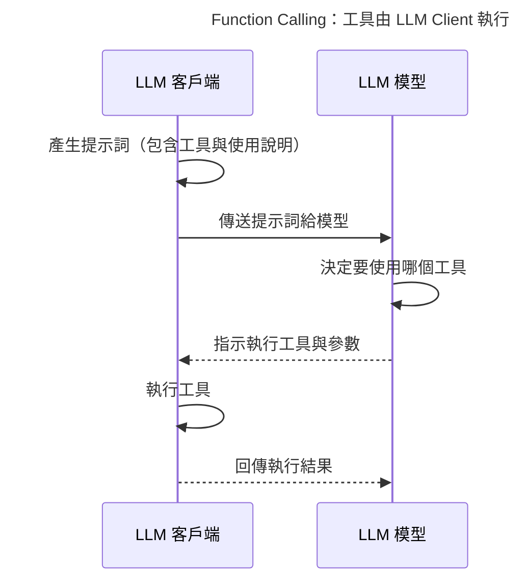
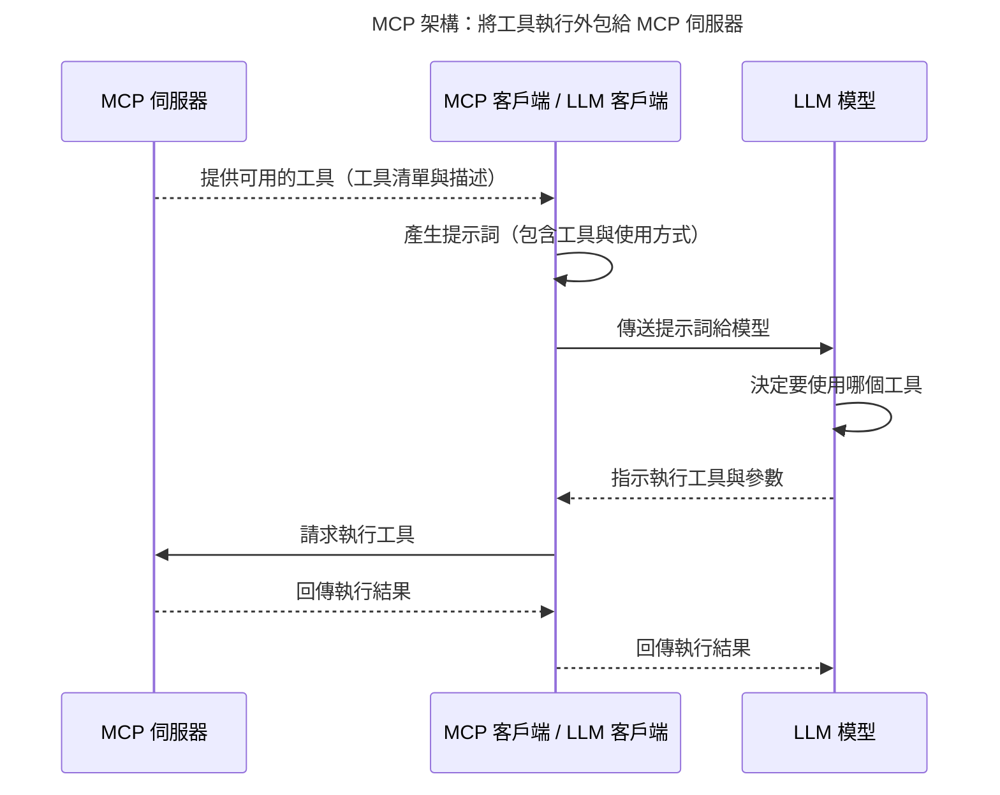

## 前言 
想把 LLM 用到產品裡，常常會卡在名詞與角色分不清楚：
LLM 到底是不是 Agent？Tool Use 的角色又是什麼？
LLM Client 跟 MCP Client 又差在哪？

本文將一次幫你把這些觀念釐清，並搭配圖解與實務建議，
讓你能真正理解這些名詞背後的結構與邏輯。

## 本文重點摘要

* **LLM（如 GPT-5）不是 Agent**：
  LLM 是「大腦」，只負責語意理解與生成。
  **Agent** 則是把 LLM 包起來，加入「決策、工具呼叫、狀態管理、記憶與流程控制」等能力的應用層。

* **LLM Client ≠ LLM ≠ Agent**：

  | 組件             | 功能定位                                              |
  | -------------- | ------------------------------------------------- |
  | **LLM**        | 模型本體，只懂推理與生成文字。                                   |
  | **LLM Client** | 與 LLM 溝通的 SDK／介面層（負責傳送 Prompt、接收回覆、控制串流、重試機制）。    |
  | **Agent**      | 將 LLM Client 包裝成具「行動能力」的應用層，會規劃步驟、判斷要不要用工具，並整合結果。 |

  Agent 通常會同時用到 **LLM Client**（與模型互動）以及 **MCP Client**（與外部工具互動）。

* **Tool Use 是模型使用外部工具的統一框架**：
  它讓模型能在一次推理中，依任務需求決定使用哪些外部能力（function、RAG、MCP 工具等），
  成為 Agent 系統的核心基礎。

* **MCP（Model Context Protocol）**：
  把「工具／資源／提示模板」用統一協定由 **MCP Server** 提供，
  而 **MCP Client** 則連線至 Server 以獲取工具清單、發出執行請求並接收結果。
  優點是標準化、跨應用可重用、易於維運與權限管理。

* **Function Calling 與 MCP 可並用**：
  在 LangChain、LangGraph 等框架中，兩者都被抽象為 `Tool`，
  模型可在一次推理中同時使用本地函式與 MCP 工具。

* **可掛多台 MCP Server**：
  不同伺服器可分別管理不同領域的工具與資源，
  MCP Client 可整合成一個「工具池」，只需注意命名空間與權限隔離。

## Tool Use 的概念

所謂 **Tool Use**，是為了解決「模型如何使用外部工具」這個問題而設計的通訊框架。
它的核心精神是：**將原本寫在每個 LLM Client 內部、處理工具呼叫的邏輯，抽離成通用協定。**

過去開發者必須在每個應用裡寫死「模型要如何呼叫工具」，
而現在只需定義好工具的 schema（名稱、參數、描述），
LLM 便能依語意自行判斷要使用哪個工具，Client 只需執行與回傳結果即可。

---

### 舊式 Function Calling 架構

在早期的 Function Calling 架構中，工具的定義與執行都綁在 LLM Client 內：

模型只決定「要用哪個工具」，但真正的執行是在 Client 內完成。
當應用越來越多，工具重複定義、難以重用成了痛點。

### MCP：把工具執行外包出去

MCP 的出現，讓工具可以由獨立的 **MCP Server** 管理與執行。
Client 不再需要實際執行工具，而是透過協定委派 Server 執行。

透過這種架構，MCP 讓工具可以跨應用共用、可集中管理，
更容易觀測、控管權限與擴充。

---

## 名詞釐清：LLM、Agent、LLM Client、MCP Client、MCP Server

| 名稱             | 角色職責                            | 關聯說明                       |
| -------------- | ------------------------------- | -------------------------- |
| **LLM**        | 模型本體，負責推理與生成文字                  | 由 LLM Client 呼叫；不具行動力      |
| **LLM Client** | 與 LLM 通訊（送 prompt、接收回覆、處理串流、重試） | 被 Agent 使用，例如 `OpenAI SDK` |
| **Agent**      | 流程與決策層，負責規劃、挑選工具與整合回覆           | 使用 LLM Client 與 MCP Client |
| **MCP Client** | 與 MCP Server 通訊，負責列出工具、執行與回傳結果  | 與 LLM Client 對稱；提供外部工具能力   |
| **MCP Server** | 註冊與管理工具、資源、Prompt 模板並執行呼叫       | 可被多個應用共用                   |

---

## MCP 和 Function Calling 能同時存在嗎？

**可以，而且建議這樣用。**

在 LangChain 或 LangGraph 中，
不論是本地函式、OpenAPI 工具、還是 MCP Server 提供的工具，
最後都會被抽象成統一的 `Tool`。
模型在推理時透過 Tool Use 自動選擇執行，
因此可以同時混用多種來源的工具。

**開發建議：**

* 工具命名加入命名空間（如 `mcp:kb.search`、`local:file.read`）。
* schema 定義要嚴謹（參數型別、預設值、範例），避免模型亂填。
* 在 System Prompt 明確指示何時使用 MCP、何時使用本地函式。

## 可以掛多個 MCP Server 嗎？

**可以**

例如：

* 一台管理內部資料檢索
* 一台專職文件摘要與報告生成
* 一台負責企業內部 API 呼叫

MCP Client 可以一次連線多台 Server，
將所有工具整合成一個「統一工具池」。
但記得要做好：

* 命名空間區分（避免名稱衝突）
* 權限與網路安全控管
* 各 Server 的觀測與監控分離

## 實作建議（以 LangChain／LangGraph 為例）

1. 選擇模型供應商（如 OpenAI／Anthropic／Gemini）並建立 **LLM Client**。
2. 連接一台或多台 **MCP Server**（支援 STDIO、HTTP+SSE 或 Streamable HTTP）。
3. 透過 `langchain-mcp-adapters` 轉換 MCP 工具為 LangChain `Tool`。
4. 把 MCP 工具與本地函式工具一同掛入 Agent／Graph。
5. 啟用 Tracing（如 LangSmith）觀測每次工具呼叫、延遲、錯誤與 Token 成本。
6. 規劃命名空間、權限、重試邏輯與串流任務（特別是 SSE 或長任務）。

## 常見誤區與提醒

* ❌ **把 LLM 誤認為 Agent**：LLM 只是「想」，不會「做」。
* ❌ **以為 Function Calling 模型會自己執行工具**：模型只輸出意圖，執行在外部層。
* ❌ **工具綁死在應用程式內**：應用之間無法重用，導致整合困難。
  ✅ 改用 MCP Server 統一管理，讓工具模組化。
* ❌ **單一 MCP Server 裝太多東西**：容易造成維運負擔。
  ✅ 依業務域拆分多台，權限與穩定性更好。
* ❌ **未設觀測或追蹤**：缺乏 Tracing 會讓除錯與優化困難。

## 結語

隨著 **Tool Use** 與 **MCP** 成為新一代 LLM 生態的核心標準，
開發者不再只是「讓模型會講話」，而是「讓模型能行動」。
LLM 是大腦、Tool 是手腳、MCP 是神經網絡，
而 Agent 則是協調這一切的靈魂。

掌握這層結構，你就能設計出真正能思考又能執行的智慧系統。
