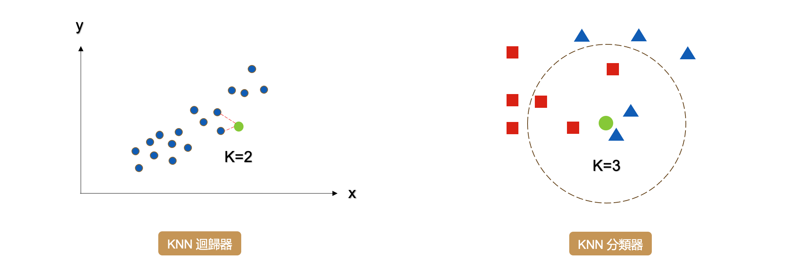
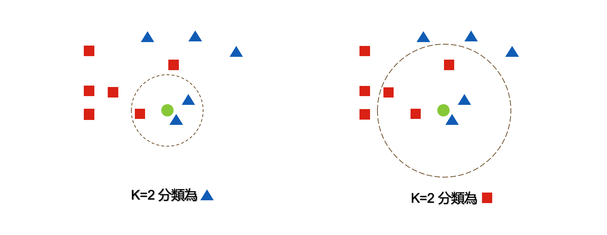
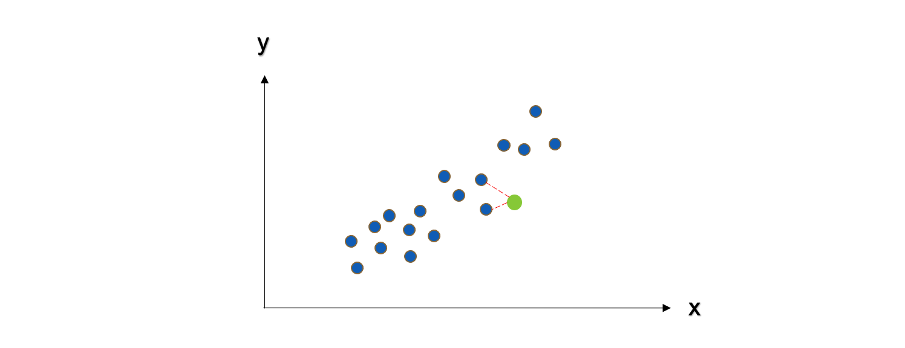
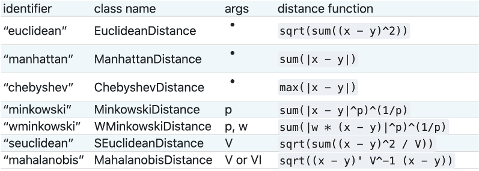
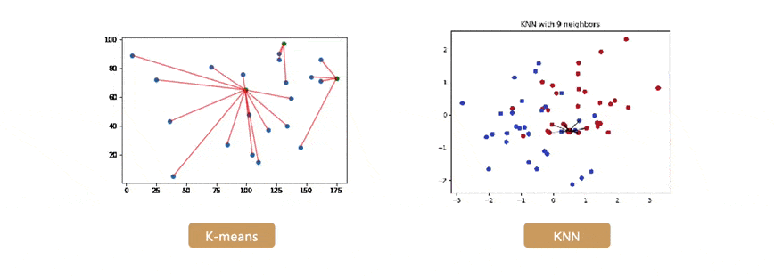

# KNN
## 今日學習目標

- K-近鄰演算法介紹 
    - KNN 計算步驟解析
- 實作 KNN 分類器與迴歸器
    - 觀察不同 K 值會對分類結果造成什麼影響

## K-近鄰演算法 (KNN)
KNN 的全名 K Nearest Neighbor 是屬於機器學習中的 Supervised learning 其中一種算法，顧名思義就是 k 個最接近你的`鄰居`。分類的標準是由鄰居「多數表決」決定的。在 Sklearn 中 KNN 可以用作分類或迴歸的模型。

## KNN 分類器
在分類問題中 KNN 演算法採多數決標準，利用 k 個最近的鄰居來判定新的資料是在哪一群。其演算法流程非常簡單，首先使用者先決定 k 的大小。接著計算目前該筆新的資料與鄰近的資料間的距離。第三步找出跟自己最近的 k 個鄰居，查看哪一組鄰居數量最多，就加入哪一組。

1. 決定 k 值
2. 求每個鄰居跟自己之間的距離
3. 找出跟自己最近的 k 個鄰居，查看哪一組鄰居數量最多，就加入哪一組
> 如果還是沒辦法決定在哪一組，回到第一步調整 k 值，再繼續

k 的大小會影響模型最終的分類結果。以下圖為例，假設綠色點是新的資料。當 k 等於 2 時會搜尋離綠色點最近的鄰居，我們可以發現藍色三角形為預測的結果。當 k 設為 3 的時候結果又不一樣了，我們發現距離最近的三個鄰居為紅色正方形。

## KNN 迴歸器
KNN 同時也能運用在迴歸問題上面。迴歸模型輸出的結果是一個連續性數值，其預測該值是 k 個最近鄰居輸出的平均值。以下圖為例當 k=2 時，假設我們有一個輸入特徵 x 要預測的輸出為 y。當有一筆新的 x 進來的時候， KNN 迴歸器會尋找鄰近 2 個 x 的輸出做平均當作是該筆資料的預測結果。

## KNN 度量距離的方法
要判斷那些是鄰居的話，首先要量化相似度，而歐幾里得距離 (Euclidean distance) 是比較常用的方法來量度相似度。除此之外還有明可夫斯基距離(Sklearn 預設)、曼哈頓距離、柴比雪夫距離、夾角餘弦、漢明距離、傑卡德相似係數 都可以評估距離的遠近。

## KNN 與 k-means 勿混淆
KNN 的缺點是對資料的局部結構非常敏感，因此調整適當的 k 值極為重要。另外大家很常將 KNN 與 K-means 混淆，雖然兩者都有 k 值要設定但其實兩者無任何關聯。KNN 的 k 是設定鄰居的數量採多數決作為輸出的依據。而 K-means 的 k 是設定集群的類別中心點數量。

## []

