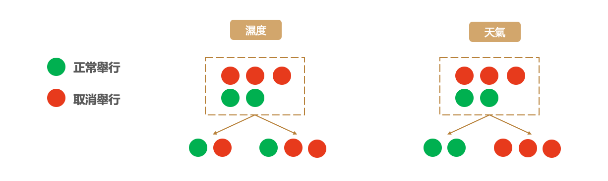
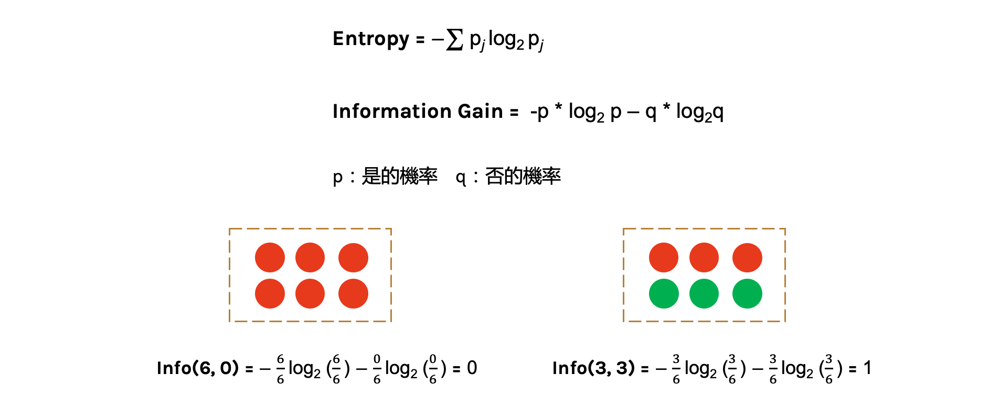
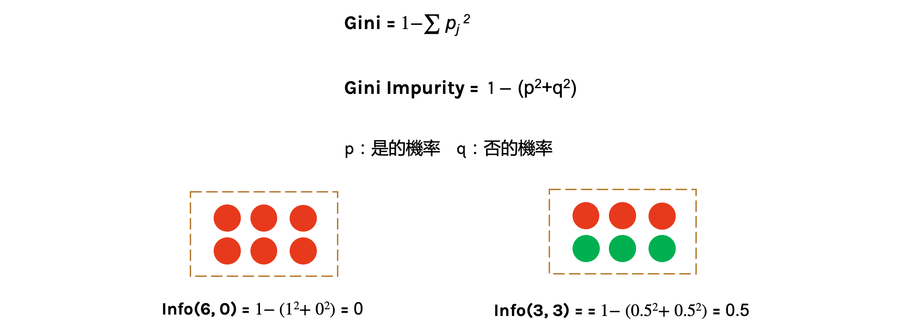

# 決策樹

## 今日學習目標
- 決策樹演算法介紹
    - 決策樹如何生成?
    - 如何處理分類問題?
    - 如何處理迴歸問題?
- 實作決策樹分類器
    - 觀察決策樹是如何生成的
- 實作決策樹迴歸器
    - 查看決策樹方法在簡單線性迴歸和非線性迴歸表現

##  決策樹
決策樹會根據訓練資料產生一棵樹，依據訓練出來的規則來對新樣本進行預測。決策樹演算法可以使用不同的方式來評估分枝的好壞(亂度)，例如像是 Information gain、Gain ratio、Gini index。依據訓練資料找出合適的規則，最終生成一個規則樹來決策所有事情，其目的使每一個決策能夠使訊息增益最大化。就好比我們評估今天比賽是否舉行，天氣因子可能站比較大的因素，而 Co2 的濃度高低可能站的因子程度較低。因此在第一層的決策中以天氣的特徵先進行第一次的決策判斷。接著第二層再從所有特徵中尋找最適合的決策因子，直到設定的最大樹的深度即停止樹的生長。

## 決策樹如何生成？
決策樹是以一個貪婪法則來決定每一層要問什麼問題，目標是分類過後每一群能夠很明顯的知道是屬於哪一種類別。延續上面的例子，以分類問題來說假設要評估明天比賽是否舉行。在樹的第一層節點中我們要從已知的兩個特徵分別是溫度與特徵選一個作為該層的決策因子。假設目前訓練集有五筆資料，其中正常舉行的有後筆資料，取消舉行的有三筆資料。在樹的結構中左子樹為決策正常取行，而右子樹是決策取消舉行。我們可以發現當特徵為天氣的時候可以一很清楚的將這兩類別完整分開，因此我們會將天氣作為這一層判斷的因子。這就是決策樹在生成中的貪婪機制。然而要如何去判斷每次決策的好壞，就必須依靠亂度的評估指標。

## 決策樹的混亂評估指標
我們需要客觀的標準來決定決策樹的每個分支，因此我們需要有一個評斷的指標來協助我們決策。決策樹演算法可以使用不同的指標來評估分枝的好壞，常見的決策亂度評估指標有 Information gain、Gain ratio、Gini index。我們目標是從訓練資料中找出一套決策規則，讓每一個決策能夠使訊息增益最大化。以上的指標都是在衡量一個序列中的混亂程度，其數值越高代表越混亂。然而在 Sklearn 套件中預設使用 Gini。

- Information gain (資訊獲利) 
- Gain ratio (吉尼獲利)
- Gini index (吉尼係數)  = Gini Impurity (吉尼不純度)

## 評估分割資訊量
Information Gain 透過從訓練資料找出規則，讓每一個決策能夠使訊息增益最大化。其算法主要是計算熵，因此經由決策樹分割後的資訊量要越小越好。而 Gini 的數值越大代表序列中的資料亂，數值皆為 0~1 之間，其中 0 代表該特徵在序列中是完美的分類。常見的資訊量評估方法有兩種：資訊獲利 (Information Gain) 以及 Gini 不純度 (Gini Impurity)。

## 熵 (Entropy)
熵 (Entropy) 是計算 Information Gain 的一種方法。在了解 Information Gain 之前要先了解熵是如何被計算出來的。其中在下圖公式中 p 為是的機率、q 為否的機率。我們可以從圖中範例很清楚地知道當所有的資料都被分類一致的時候 Entropy 即為 0，當資料各有一半不同時 Entropy 即為 1。

## Gini 不純度 (Gini Impurity)
Gini 不純度是另一種亂度的衡量方式，它的數字越大代表序列中的資料越混亂。公式如下所示，其中 p 為是的機率、q 為否的機率。我們可以從圖中範例很清楚地知道當所有的資料都被分類一致的時候混亂程度即為 0，當資料各有一半不同時混亂程度即為 0.5。

##  決策樹 (迴歸器)
決策樹迴歸方法與分類有點類似差別僅在於評估分枝好壞的方式不同。當數據集的輸出爲連續性數值時，該樹算法就是一個迴歸樹。透過樹的展開，並用葉節點的均值作爲預測值。從根節點開始，對樣本的某一特徵進行測試。經過評估後，將樣本分配到其子結點。此時每一個子節點對應著該特徵的一個值。依照這樣方式進行，直至到達葉結點。此時誤差(loss)為0。

## CART 決策樹
- scikit-learn 決策樹演算法採用 CART (Classification and Regression Tree) 樹演算法。
- 可以做分類和迴歸預測。
- 在每一個節點上都是採用二分法。

## 決策樹模型的優缺點
建立決策樹的過程就是不斷的尋找特徵進行決策，透過這些決策盡量的使這些資料被分為同一個類別，且試著讓混亂程度越小越好。切記樹的深度越深不一定越好，他可能會造成過度擬合的問題。訓練好的模型我們能夠視覺化決策樹的結構，相對的可解釋性就變高。此外與其它的ML模型比較起來，決策樹執行速度是它的一大優勢。因為是樹狀結構，因此在進行機器學習的時候每個決策階段都相當的明確清楚，不是 0 就是 1。

## 決策樹總結
決策樹透過所有特徵與對應的值將資料切分，來找出最適合的分枝並繼續往下拓展。若決策樹深度越深，則決策規則越複雜，模型也會越接近數據，但若數據中含有雜訊，太深的樹就有可能產生過擬合的情形。因此單一的迴歸樹肯定是不夠用的。可以利用集成學習中的 Boosting 架構，對迴歸樹進行改良升級。