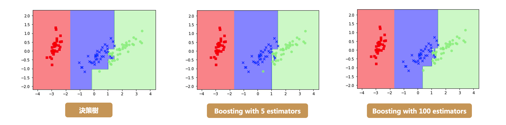

# XGBoost

## 今日學習目標
- XGBoost 介紹
    - XGBoost 是什麼?為什麼它那麼強大?
- Bagging vs. Boosting
    - 比較兩種集成式學習架構差異
- 實作 XGBoost 分類器與迴歸器
    - 比較 Bagging 與 Boosting 兩者差別

## 人人驚奇的 XGBoost
XGboost 全名為 eXtreme Gradient Boosting，是目前 Kaggle 競賽中最常見到的算法，同時也是多數得獎者所使用的模型。此機器學習模型是由華盛頓大學博士生陳天奇所提出來的，它是以 Gradient Boosting 為基礎下去實作，並添加一些新的技巧。它可以說是結合 Bagging 和 Boosting 的優點。XGboost 保有 Gradient Boosting 的做法，每一棵樹是互相關聯的，目標是希望後面生成的樹能夠修正前面一棵樹犯錯的地方。此外 XGboost 是採用特徵隨機採樣的技巧，和隨機森林一樣在生成每一棵樹的時候隨機抽取特徵，因此在每棵樹的生成中並不會每一次都拿全部的特徵參與決策。此外為了讓模型過於複雜，XGboost 在目標函數添加了標準化。因為模型在訓練時為了擬合訓練資料，會產生很多高次項的函數，但反而容易被雜訊干擾導致過度擬合。因此 L1/L2 Regularization 目的是讓損失函數更佳平滑，且抗雜訊干擾能力更大。最後 XGboost 還用到了一階導數和二階導數來生成下一棵樹。其中 Gradient 就是所謂的一階導數，而 Hessian 即為二階導數。 

## Bagging vs. Boosting
XGBoost 是 boosting 方法的其中一種實例。

- Bagging 透過抽樣的方式生成樹，每棵樹彼此獨立
- Boosting 透過序列的方式生成樹，後面生成的樹會與前一棵樹相關

- [超參數解析](https://medium.com/@pahome.chen/xgboost%E5%85%A5%E9%96%80%E7%B6%93%E9%A9%97%E5%88%86%E4%BA%AB-e06931b835f5)
- [關於 XGBoost 20 Faq](https://towardsdatascience.com/20-burning-xgboost-faqs-answered-to-use-the-library-like-a-pro-f8013b8df3e4)

## XGB優點
- XGB利用了二階梯度來對節點進行劃分
- 利用局部近似算法對分裂節點進行優化
- 在損失函數中加入了L1/L2項，控制模型的複雜度
- 提供 GPU 平行化運算

XGBoost 最初是由陳天奇於 2014 年 3 月發起的一個研究項目。2017 年 1 月，微軟發布了第一個穩定的 LightGBM 版本。2017 年 4 月，俄羅斯的一個領先的科技公司—Yandex，發布開源CatBoost

