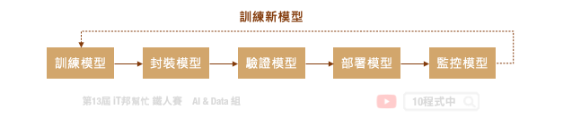
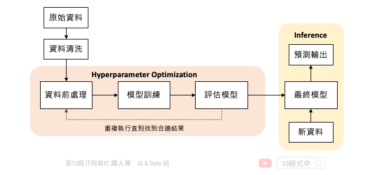

# AutoML

## AutoML 的動機
大家還記得在 [[Day 5] 機器學習大補帖](https://ithelp.ithome.com.tw/articles/10265942) 中有提到完整的機器學習流程大致分成八個步驟。然而模型的訓練與超參數調整僅扮演其中的一環，選擇一個好的模型事件重要的事情。想必大家在訓練模型時一定會遇到一個棘手的問題，就是該如何正確選擇模型以及超參數？隨著越來越多的演算法不斷地被開發出來，要從茫茫大海中挑選一個合適的模型是件耗時的事。因此自動化機器學習 (Automated Machine Learning ,AutoML) 可以幫助我們在有限的時間內找出一個適合的模型。在近年來有許多人開始研究這類的問題，筆者彙整了幾個 Python 熱門的 AutoML 開源套件：

- [AutoGluon](https://www.automl.org/automl/#:~:text=AutoML%20packages%20include%3A-,AutoGluon,-is%20a%20multi)
- [Auto-sklearn](https://automl.github.io/auto-sklearn/master/)
- [FLAML](https://github.com/microsoft/FLAML)
- [H2O AutoML](http://docs.h2o.ai/h2o/latest-stable/h2o-docs/automl.html)
- [LightAutoML](https://github.com/sberbank-ai-lab/LightAutoML)
- [Pycaret](https://pycaret.org/)
- [MLJAR](https://mljar.com/)
- [TPOT](https://github.com/EpistasisLab/tpot)
- [MLBox](https://github.com/AxeldeRomblay/MLBox)
- [Auto-PyTorch](https://github.com/automl/Auto-PyTorch)
- [AutoKeras](https://autokeras.com/)
- [talos](https://github.com/autonomio/talos)

## AutoML 扮演的角色
自動化機器學習提供了一系列的方法和自動化的學習流程，以提高機器學習的效率並加速機器學習的研究。透過 AutoML 集結專家的先驗知識，大幅降低了機器學習建模的困難度。雖然領域專家與 AI 工程師必然扮演重要的角色，但是近年來 `No Code` 無程式碼開發平台形成一股潮流。AI 再也不是需要資訊背景的人才能做的事，目的是讓大家不用透過寫程式也能快速地進行資料探索與建立預測模型。然而近年來許多企業開發了各種需求的 AutoML 平台，如雨後春雨般的出現：

- Google: Cloud AutoML
- Microsoft: Azure Machine Learning
- Amazon: SageMaker Autopilot
- Landing AI: LandingLens
- Chimes AI: tukey

## AutoML 能幫助多少事情
典型的機器學習流程是一個迭代的循環週期，從定義問題、資料收集與處理、模型設計到最終模型部署，每個步驟極為重要且缺一不可。此外一個好的機器學習的專案需要執行 MLOps 的流程，才能夠讓模型在實際應用場景越來越好真實地解決問題。MLOps 這一名詞近年來非常熱門，它其實就是 ML (機器學習) 與 DevOps (開發與維運) 的結合。指的是從 AI 模型訓練到部署上線的一套完整機器學習工作流程。如下圖所示從訓練模型到正式部署中間還有許多事情要處理，而模型上線後還是要持續監控並收集新的場域資料。最後將資料收集到一定程度，又回到週期的第一步重新訓練新模型。至於模型該如何重新訓練並保持資料的隱私性就是另一門議題。這時候我們就能採用一個技術叫做 Federated Learning (聯合學習) 想辦法處理這類的事情。

我們可以發現訓一個練機器學習模型在 MLOps 的週期中僅扮演小小的一塊角色。訓練一個好的模型是整個專案中重要的關鍵，但是若有一個自動化的流程可以加速模型的開發。下圖是一個訓練機器學習模型的基本流程。中間橘色的部分就是 AutoML 可以幫助我們的事，從資料前處理、訓練到評估模型需要不斷地的進行試驗，並且嘗試不同的模型演算法、模型超參數、資料前處理與特徵工程，直到得到滿意的結果。

中間橘色的部分就是 AutoML 可以幫助我們的事，必須對資料處理方法、模型的演算法和許多不同組的合超參數進行試驗，直到得到滿意的結果。