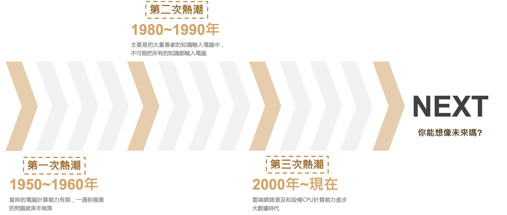
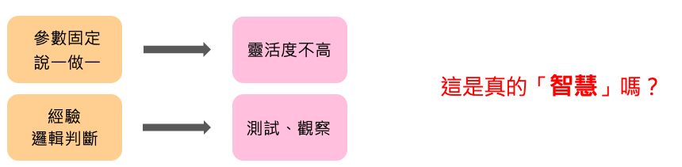
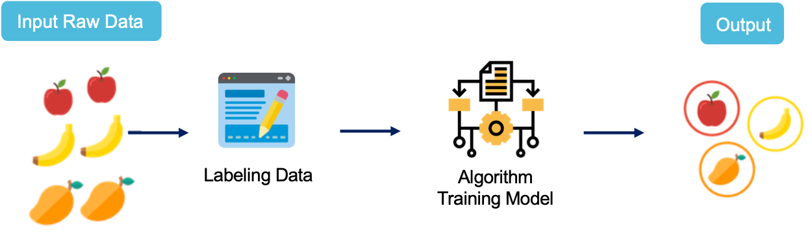

# 快來探索AI的世界
## Day 2 學習目標
- 人工智慧的演進
- 人工智慧的分級
- 機器是如何學習的

## 人工智慧的演進
AI 與機器學習技術正在蓬勃發展中，你能想像 AI 人工智慧曾被認為是一個毫無出路的領域嗎? 從人工智慧的時間軸來看可以分為三個熱潮。第一次熱潮（1950~1960年），由於早期的電腦硬體資源的不足導致複雜的問題無法輕易的解決。第二次熱潮（1980~1990年）將帶有知是本體的代理人放入機器人中使具有智慧，也就是所謂的專家系統。但人類資源有限不可能把所有的知識都逐一地輸入到電腦。因此大家開始思考機器是否能夠讓他自己去學習？而不是人類一昧的餵入這些知識。第三次熱潮（2000年~現在）由於 CPU、GPU 以及雲端運算資源普及，早期複雜難解的演算法陸續可以透過超級電腦來解決。當手邊有了大量的數據就能拿來機器學習，因此大家踏入了大數據以及深度學習的時代。時間不斷的往前走，你能想像未來的 AI 在世界上是扮演什麼樣的角色嗎？

## 人工智慧的分級
人工智慧依照機器能夠處理與判斷的能力大致分為四級：

### 第一級人工智慧：自動控制
機器含有自動控制的功能，並且經由感測器偵測環境的資訊。例如透過溫度感測器來偵測產線的馬達是否過熱，並達到停止運轉效果。或是冷氣低於20度時就進入待機模式……等。因此程式設計師必須先把所有可能的情況都考慮進去才能寫出控制程式。這就衍伸出一些問題，像是靈活度不高，且需要有經驗的專家介入才能完成。

### 第二級人工智慧：探索推論
這邊逐漸開始強調邏輯推理，可以說是補足第一級的問題。將知識組織成Ontology(知識本體)並讓機器從知識本體中去推論。典型的例子就是專家系統，他是透過特定領域的專家訂定出一套知識庫與規則庫，並產生大量輸入與輸出資料的排列組合來解決日常生活中的問題。

### 第三級人工智慧：機器學習
機器可以根據資料學習如何將輸入與輸出資料產生關聯。機器學習是一種學習的演算法，並從資料中去學習並找出問題的解決方法。其應用包括搜尋引擎、大數據分析等。我們依據資料與學習方式可大致分為監督式學習、非監督式學習、增強式學習，此外自監督學習這個名詞最近也熱烈的討論中。

### 第四級人工智慧：深度學習
深度學習是一種機器學習的方法。它藉由模仿人類大腦神經元的結構，定義解決問題的函式。所謂深度學習是一種具有深度多層的神經網路。機器可以自行學習並且理解機器學習時用以表示資料的「特徵」，因此又稱為「特徵表達學習」，其應用包括：影像分類、機器翻譯...等。

## 機器如何學習？
### 監督式學習 (Supervised Learning)
所謂的監督式學習是給許多資料並給與答案，透過損失函數計算來找出一個最佳解。舉一個簡單的例子，比如給機器各看了 1000 張蘋果和橘子的照片後再詢問機器新的一張照片中是蘋果還是橘子。一直不斷的迭代訓練並從錯誤中去學習，最終機器能成功的分類了。

### 非監督式學習 (Unsupervised Learning)
- 給許多資料不給答案，從資料中自己去找出關係，資料與資料間的相似程度與距離(分群演算法)

### 半監督學習 (Semi-Supervised Learning)

### 強化式學習 (Reinforcement Learning)
- 從環境中去學習，給獎賞和逞罰

特別的是，最新出爐的108課綱首度將程式語言納入中學課程，政府將「與電腦對話的能力」視為未來台灣重要的競爭力，開始向下扎根；對於白領工作者而言，透過程式語言工具為自己加值，更是近幾年的大趨勢。

Python 是近幾年高速成長並且逐漸普及的程式語言，也可以說是最容易使用的程式語言之一。主要在於它的語法是簡化而不複雜的，同時強調自然語言，更貼近使用者的習慣。

https://aiacademy.tw/article-5-reasons-learning-python/

https://explained.ai/