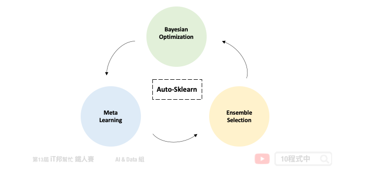
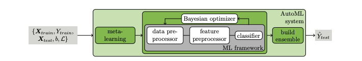
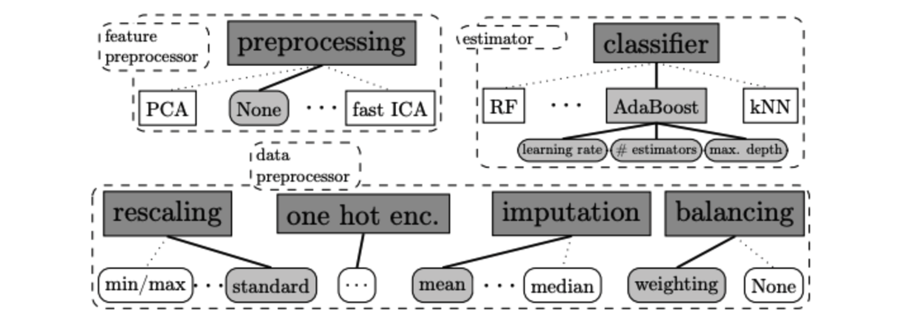
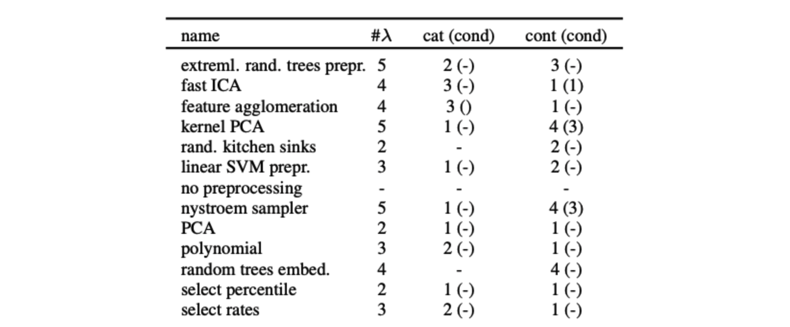

# Auto-sklearn

## 今日學習目標
- 了解 Auto-sklearn 運作原理
    - Meta Learning
    - Bayesian Optimization
    - Build Ensemble
- 實作 Auto-sklearn
    - 採用鳶尾花朵分類器，比較兩種不同版本的 Auto-sklearn。

## 前言
Auto-sklearn 採用元學習 (Meta Learning) 選擇模型和超參數優化的方法作為搜尋最佳模型的重點。此 AutoML 套件主要是搜尋所有 Sklearn 機器學習演算法以模型的超參數，並使用貝葉斯優化 (Bayesian Optimization) 與自動整合 (Ensemble Selection) 的架構在有限時間內搜尋最佳的模型。第一版的 Auto-sklearn 於 2015 年發表在 NIPS(Neural Information Processing Systems) 會議上，論文名稱為 [Efficient and Robust Automated Machine Learning](https://proceedings.neurips.cc/paper/2015/file/11d0e6287202fced83f79975ec59a3a6-Paper.pdf)。有別於其他的 AutoML 方法，Auto-sklearn 提出了元學習架構改善了貝葉斯優化在初始冷啟動的缺點，並提供一個好的採樣方向更快速尋找最佳的模型[1]。第二個版本於 2020 年發布，論文名稱為 [Auto-Sklearn 2.0: Hands-free AutoML via Meta-Learning](https://arxiv.org/abs/2007.04074)。在新的版本中修改了元學習架構，並不依賴元特徵來選擇模型選擇與調參策略。而是引入了一個元學習策略選擇器，根據資料集中的樣本數量和特徵，訂定了一個模型選擇的策略[2]。



## AutoML 視為 CASH 問題
在論文中作者將 AutoML 視為演算法選擇和超參數優化 (Combined Algorithm Selection and Hyperparameter, CASH) 的組合最佳化問題。因為在 AutoML 領域當中將會面臨兩個問題。第一個是沒有任何的演算法模型是可以保證在所有的資料集中表現最好，因此挑選一個好的演算法是自動化機器學習的首要任務。第二許多的機器學習模型往往依賴於超參數，透過不同的超參數設定可以取得更好的學習結果。例如在 SVM 方法中我們可以設定不同的核技巧讓模型具有非線性的能力，或是透過超參數 C 限制模型的複雜度防止過度擬合。然而貝葉斯優化如今成為 AutoML 超參數搜尋的重要核心方法。



## Auto-sklearn 架構
Auto-sklearn 可以被拿來處理迴歸和分類的問題。下圖為第一版論文中所繪製的架構圖。我們可以將 Auto-sklearn 切成三個部分，其中第一個是引入元學習機制來模仿專家在處理機器學習的先驗知識。並採用元特徵讓我們更有效率的去決定在新的資料集中該挑選哪一種機器學習模型。接著挑好模型後並透過貝葉斯優化來挑選合適的模型超參數，以及嘗試一些資料前處理與特徵工程。最後挑選幾個不錯的模型並透過鞥體學席的技巧進行模型堆疊，將表現不錯的模型輸出結果做一個加權和或是投票。

- Meta Ｌearning
- Bayesian Optimization
- Build Ensemble 


## Meta Learning
當我們想對新資料集做分類或回歸時，Auto-sklearn 會先提取元特徵，具有相似元特徵的資料集在同一組超參數應該會有相似的表現。因此透過元特徵可以有效地評估在新資料集上應該使用哪種算法。元學習在這裡的目的是為了要找一個不錯的超參數做初始化，使其在一開始的表現優於隨機的方法。並提供貝葉斯優化有個明確定方向。Auto-sklearn 參考了 OpenML 140 個資料集，並彙整了 38 個元特徵，例如：偏度、峰度、特徵數量、類別數量......等。首先為這 140 個資料集使用貝葉斯優化進行模型訓練，並將這些資料集對應的模型與最佳的超參數儲存起來。當有新的資料集進來時會先透過元特徵進行相似度匹配，並將匹配程度最高的前 k 個資料集 (預設k=25) 所對應的模型和超參數作為貝葉斯優化的初始設定。

## Bayesian Optimization
在貝葉斯優化當中主要會尋找該資料集中最合適的資料前處理 (data pre-processors)、特徵前處理 (feature pre-processors) 與分類/回歸模型。以上三大類合計共有 110 個超參數必須透過貝葉斯優化來尋找最適合的參數組合。其貝葉斯優化主要方法是透過建立目標函數的機率模型，並用它來選擇最有希望的超參數來評估真實的目標函數。



> 以下內容摘錄自 Auto-sklearn v1.0 論文提供的內容

### Data Pre-processors
在資料前處理部分 Auto-sklearn 提供了四種方法。包含特徵縮放、填補缺失值、類別特徵進行 one-hot encoding 與處理目標輸出類別數量不平衡問題。

- Data Pre-processors
    - 特徵縮放
    - 填補缺失值
    - one-hot encoding
    - 類別資料不平衡

> 在新的版本中多了一些資料前處理方法，詳細可以參考 Auto-sklearn [data_preprocessing](https://github.com/automl/auto-sklearn/tree/master/autosklearn/pipeline/components/data_preprocessing) 的原始程式。
    
### Feature Pre-processors
在特徵前處理部分 Auto-sklearn 提供了 12 種特徵處理的技巧，然而在眾多方法中僅會挑選其中一種。



> 詳細可以參考 Auto-sklearn [feature_preprocessing](https://github.com/automl/auto-sklearn/tree/master/autosklearn/pipeline/components/feature_preprocessing) 的原始程式。

## Build Ensemble
多個模型組合成一個更強更大的模型。往往能提高預測準確性。


## 安裝 Auto-sklearn
目前 Auto-sklearn 僅支援 Lunux 系統。若沒有此系統的讀者可以透過 Colab 體驗。另外若安裝過程中出現錯誤，必須先確認 [swig](https://automl.github.io/auto-sklearn/master/installation.html) 是否已完成安裝。

```bash
pip install auto-sklearn
```

## Reference
- [1] Feurer, Matthias et al. “Efficient and Robust Automated Machine Learning”. Advances in neural information processing systems 2015. https://automl.github.io/auto-sklearn
- [2] Ono, Jorge et al. “PipelineProfiler: A Visual Analytics Tool for the Exploration of AutoML Pipelines”. 2020. https://arxiv.org/abs/2005.00160

- [Auto Machine Learning筆記- Bayesian Optimization](http://codewithzhangyi.com/2018/07/31/Auto%20Hyperparameter%20Tuning%20-%20Bayesian%20Optimization/)