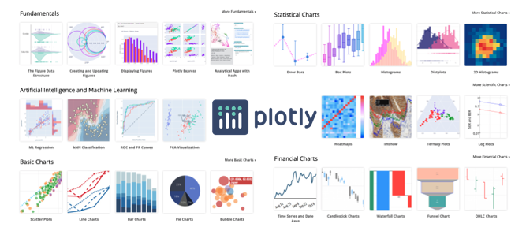

# Python 視覺化解釋數據：Plotly Express

## Plotly Express
Plotly Express 是一個高精緻的資料視覺化套件。初學機器學習的你一定碰過像是 matplotlib 和 seaborn 這類型的圖表化套件，不過使用過 Plotly Express 會讓你對於資料視覺化有更不一樣的體驗。它的功能使用起來非常直觀，並且可以很好地與 Pandas DataFrame 配合使用。[Plotly Express](https://plotly.com/python/plotly-express/) 於 2019 年由加拿大 Plotly 這間公司釋出了第一版高階的 Python 資料視覺化套件。



## 安裝 plotly
若尚未安裝此套件的讀者，可以開啟終端機輸入以下指令進行安裝：

```py
pip install plotly
```

在今天的範例中我們一樣採用鳶尾花朵資料集來做示範，讓大家瞧瞧 Plotly Express 是如優雅的處理資料視覺化。


由於 Plotly Express 只能將結果渲染在網頁瀏覽器上面，因此必須轉換成 HTML code 並在 Jupyter Notebook 顯示出來。