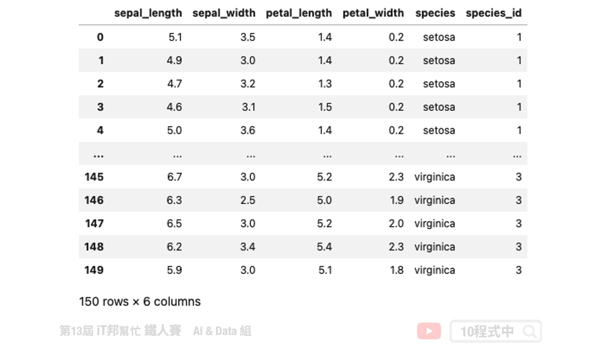
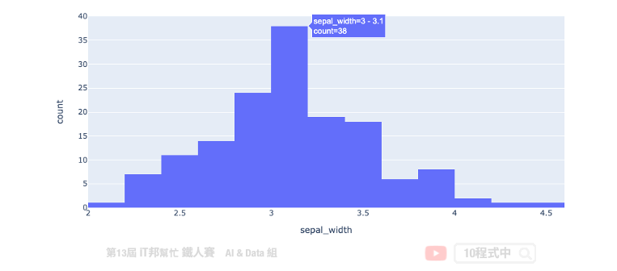
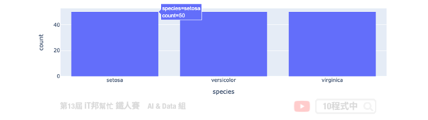

# Python 視覺化解釋數據：Plotly Express

## Plotly Express
Plotly Express 是一個高精緻的資料視覺化套件。初學機器學習的你一定碰過像是 matplotlib 和 seaborn 這類型的圖表化套件，不過使用過 Plotly Express 會讓你對於資料視覺化有更不一樣的體驗。它的功能使用起來非常直觀，並且可以很好地與 Pandas DataFrame 配合使用。[Plotly Express](https://plotly.com/python/plotly-express/) 於 2019 年由加拿大 Plotly 這間公司釋出了第一版高階的 Python 資料視覺化套件。


## 安裝 plotly
若尚未安裝此套件的讀者，可以開啟終端機輸入以下指令進行安裝：

```py
pip install plotly
```

## 1) 載入資料集
在今天的範例中我們一樣採用鳶尾花朵資料集來做示範，讓大家瞧瞧 Plotly Express 是如優雅的處理資料視覺化。

```py
import plotly.express as px
import plotly.graph_objects as go
from IPython.display import HTML

df_data = px.data.iris()
df_data
```



## 直方圖
為了更清楚了解特徵的分布狀況，我們可以採用直方圖 histogram 做更近一步的分析。從直方圖我們可以更清楚知道特徵的每個值的頻率分佈。由於目前版本在 Notebook 無法直接使用 fig.show() 顯示互動圖，必須安裝一些小插件模組與設定。因此範例中採用最簡單方法，先轉換成 HTML code 並透過 IPython.display 中的 HTML 方法顯示出來。

```py
fig = px.histogram(df_data, x="sepal_width")
HTML(fig.to_html())
```



除此之外我們也能觀察每一個獨立特徵對於花的品種的每個分布狀況。每個不同的顏色代表不同的花朵品種，我們可以藉由參數設定每個直方圖是否重疊，以及重疊的透明程度。

```py
fig = px.histogram(df_data, x="sepal_width", color="species")
fig.update_layout(barmode='overlay')
fig.update_traces(opacity=0.75)
HTML(fig.to_html())
```


接下來一樣透過直方圖方式來觀察每個花朵品種的數量。從視覺化可以很清楚得知該資料集是否是一個平穩的資料集。

```py
fig = px.histogram(df_data, x='species', y='sepal_width', histfunc='count', height=300,
                    title='Histogram Chart')
HTML(fig.to_html())
```

