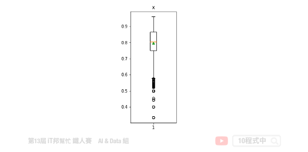
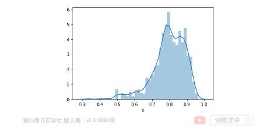
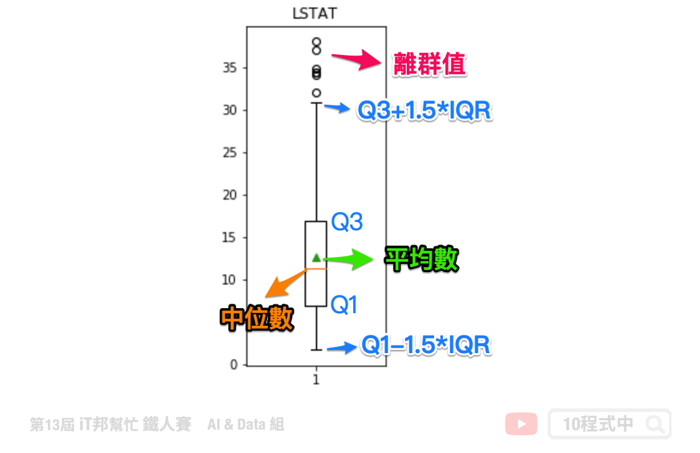
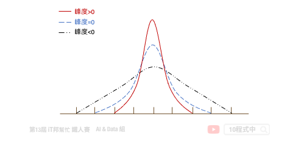
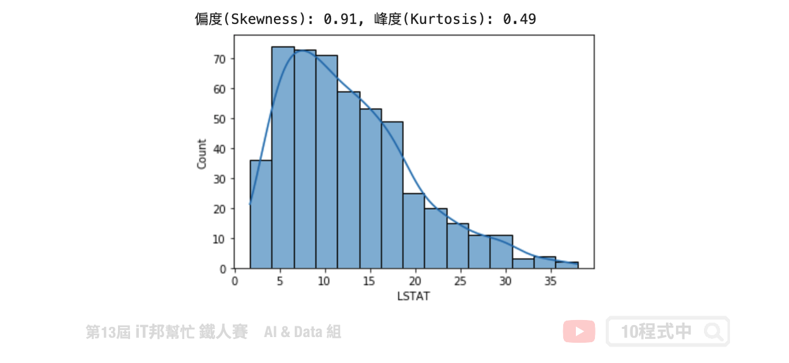
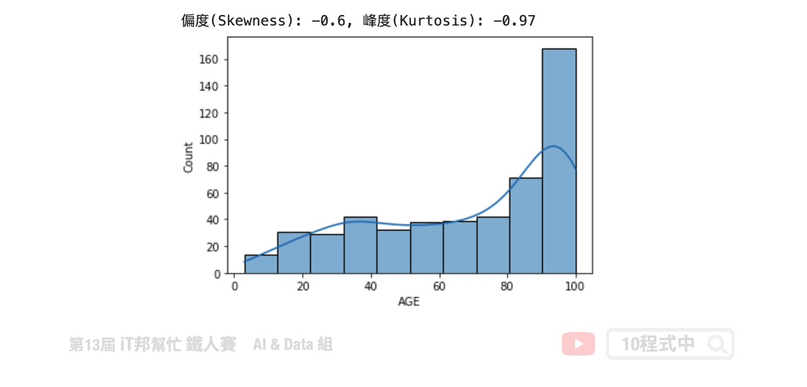

## 今日學習目標
- 檢視資料的分布狀態
    - 偏度 (Skewness)
    - 峰度 (Kurtosis)
- 修正資料偏度的方法

## 前言
資料前處理 (Data Preprocessing)，是機器學習中最重要的一部分。今日的內容可分為兩部份，前半部份算是一些對資料的觀察、分析(EDA)，後半部主要是針對特徵 x 進行統計方法的資料分布觀察以及如何修正資料左、右偏的方法。

## 載入資料
在今日的範例中我們採用波士頓房價預測的資料集。此資料集共有 506 筆資料。其中我們挑選兩個特徵來進行示範，分別有 LSTAT: 區域中被認為是低收入階層的比例、AGE: 1940年之前建成的自用房屋比例。

```py
import pandas as pd  
import matplotlib.pyplot as plt 
import seaborn as sns 
from sklearn.datasets import load_boston

# 載入資料集
boston_dataset = load_boston()
# 將資料轉換成pd.DataFrame格式。目標輸出是MEDIV，剩下的就是特徵即為輸入特徵。
boston = pd.DataFrame(boston_dataset.data, columns=boston_dataset.feature_names)
boston['MEDV'] = boston_dataset.target
boston
```



我們可以透過 Pandas 的 `describe()` 方法先來查看每個特徵的平均數、標準差、四分位數以及最大值與最小值。

```py
# 查看資料分布狀況
boston.describe()
```



## 離群值分析
以 `LSTAT` 特徵舉例。我們可以透過 boxplot 來查看該特徵在 506 筆資料中的分布狀況，我們可以看出平均值約 12，最大值接近 38，最小值接近 2。我們可以發現大於 32 以外有多個零散的數據點，這些資料我們可以來分析是否為異常點。因為這些異常點所造成的離群值可能會造成特徵的分布狀況嚴重的偏移。

```python
plt.figure(figsize=(2,5))
plt.boxplot(boston['LSTAT'],showmeans=True)
plt.title('LSTAT')
plt.show()
```




## 偏度 & 峰度
### 偏度 (Skewness)
偏度 (Skewness) 是用來衡量資料分布的型態，同時也說明資料分配不對稱的程度。其判別方式如下：


- 右偏(正偏)，表示有少數幾筆資料很大，故平均數>中位數，所以偏度>0。
- 偏度=0 表示資料分布對稱，呈鐘形常態分布。
- 左偏(負偏)，表示有少數幾筆資料很小，故平均數<中位數，所以偏度<0。

### 峰度 (Kurtosis)
峰度 (Kurtossis) 可以反映資料的分布形狀。例如該資料是否比較高聳或是扁平的形狀。其判別方式如下：



- 若 峰度>0 表示資料呈現高峽峰。
- 若 峰度=0 表示資料呈現常態峰。
- 若 峰度<0 表示資料呈現低潤峰。

## 分布狀態
### LSTAT 特徵觀察
我們可以發現 LSTAT 特徵呈現右偏。透過 Pandas 計算該特徵的偏度與峰度。由結果可以得知偏度 `0.91>0` 呈右偏，而峰度 `0.49>0` 呈現高峽峰形狀。

```py
# 使用的資料是 LSTAT: 區域中被認為是低收入階層的比例
# skewness 與 kurtosis
skewness = round(boston['LSTAT'].skew(), 2)
kurtosis = round(boston['LSTAT'].kurt(), 2)
print(f"偏度(Skewness): {skewness}, 峰度(Kurtosis): {kurtosis}")

# 繪製分布圖
sns.histplot(boston['LSTAT'], kde=True)
plt.show()
```



### AGE 特徵觀察
我們可以發現 AGE 特徵呈現左偏。透過 Pandas 計算該特徵的偏度與峰度。由結果可以得知偏度 `-0.6<0` 呈左偏，而峰度 `-0.97<0` 呈現低潤峰形狀。

```py
# 使用的資料是 AGE: 1940年之前建成的自用房屋比例
#skewness 與 kurtosis
skewness = round(boston['AGE'].skew(), 2)
kurtosis = round(boston['AGE'].kurt(), 2)
print(f"偏度(Skewness): {skewness}, 峰度(Kurtosis): {kurtosis}")

# 繪製分布圖
sns.histplot(boston['AGE'], kde=True)
plt.show()
```




## 修正資料偏態的方法
這裡提供兩種常見的方法來對資料進行處理，第一個是將左偏的資料取平方。第二種是透過分位數來移除離群值。

- 對數轉換 (資料不能有0或負數)
- 平方根轉換 (資料不能是負數)
- 立方根轉換
- 倒數轉換
- 次方轉換 (只能處理左偏)
- Box-Cox 轉換
- 移除離群值

### 方法一: 特徵取平方
因為資料型態左偏，因此我們可以透過取平方來將資料拉回使為更集中。


```python
exp_data = np.power(data['x'], 2)
exp_data = exp_data.replace([np.inf, -np.inf, -0], 0)
sns.distplot(exp_data)
plt.show()
```


偏度(Skewness): -0.64

> 處理右偏的資料可以參考[這篇](https://medium.com/%E4%BA%82%E9%BB%9E%E6%8A%80%E8%83%BD%E6%A8%B9%E7%9A%84%E4%BA%BA%E7%94%9F/5%E7%A8%AE%E4%BF%AE%E6%AD%A3%E8%B3%87%E6%96%99%E5%81%8F%E6%85%8B%E7%9A%84%E6%96%B9%E6%B3%95%E5%8F%8A%E5%85%B6python%E6%87%89%E7%94%A8-c387c4f32ebe)文章

### 方法二: 移除離群值
在Q3＋1.5IQR（四分位距）和Q1-1.5IQR處畫兩條與中位線一樣的線段，這兩條線段為異常值截斷點，稱其為內限；在Q3＋3IQR和Q1－3IQR處畫兩條線段，稱其為外限。處於內限以外位置的點表示的數據都是異常值，其中在內限與外限之間的異常值為溫和的異常值（mild outliers），在外限以外的為極端的異常值 (extreme outliers)。


[參考來源](https://wiki.mbalib.com/zh-tw/%E7%AE%B1%E7%BA%BF%E5%9B%BE)

因此我們必須將超出1.5倍的極端異常值清掉。

```python
print ("Shape Of The Before Ouliers: ",data.shape)
n=1.5
#IQR = Q3-Q1
IQR = np.percentile(data['x'],75) - np.percentile(data['x'],25)
#outlier = Q3 + n*IQR 
data=data[data['x'] < np.percentile(data['x'],75)+n*IQR]
#outlier = Q1 - n*IQR 
data=data[data['x'] > np.percentile(data['x'],25)-n*IQR]
print ("Shape Of The After Ouliers: ",data.shape)
```

```
Shape Of The Before Ouliers:  (2998, 1)
Shape Of The After Ouliers:  (2897, 1)
```


偏度(Skewness): -0.46

完整 Code 可以從我的 [GitHub](https://github.com/1010code/python-outliers-clean) 中取得！