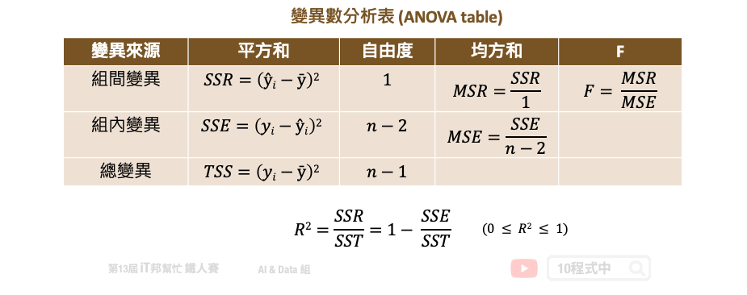

Data Issues
- 3. 在分類中生成標籤分佈不均衡的訓練/測試集
- 8. 資料收集不當
       - Ignoring prediction bias
 When wrong labels are detected, it is tempting to jump in and get them fixed. It is important to first analyze misclassified examples for the root cause. Oftentimes, errors due to incorrect labels may be a very small percentage. There might be a bigger opportunity to better train for specific data slices that might be the predominant root cause.

Process Issues
- 4. 使用 LabelEcoder 為特徵編碼
- 論特徵工程重要性

Modeling Issues
- 1. 小心使用 `fit` 或 `fit_transform`
- 2. 僅使用測試集評估模型好壞
- 5. 在沒有交叉驗證的情況下判斷模型性能
- 6. 分類問題僅使用準確率作為衡量模型的指標
- 7. 迴歸問題僅使用 R2 分數評估模型好壞

- 10. 任何事情別急著想用 AI 解決

## 迴歸問題僅使用 R2 分數評估模型好壞
在預測連續性數值輸出的迴歸模型中，大家往往會直接呼叫模型提供的評估方法直接計算 `score`。然而這個分數在迴歸模型中是計算 R2 分數，又稱判定係數 (coefficient of determination)。所謂的判定係數是輸入特徵 (x) 去解釋輸出 (y) 的變異程度有多少，其計算公式是：迴歸模型的變異量 (SSR)/總變異量 (TSS) 。用以下變異數分析表（ANOVA table）來說 TSS 就是計算總變異，把每個實際的 y 減去平均數的平方加總起來。而 SSR 就是把所有的模型預測 y 減去平均數的平方加總起來。如果 R2 分數很高越接近 1，表示模型的解釋能力很高。

在學術研究上最直覺的觀念是 R2 分數愈接近 1 越好，也有些人透過一些手段來製造 R2 分數很高的假象，詳細內容可以參考這篇[文章](http://amebse.nchu.edu.tw/new_page_535.htm)。其實只透過 R2 個評估指標就來決定一個模型的好壞是不太好的習慣。更進一步可以使用 MSE、MAE 等殘差的評估值標來看每筆資料實際值與預測值的誤差。或是使用相對誤差來觀察預測模型的可信度。此外筆者還建議可以試著把每筆資料的真實 y 與模型預測的 ŷ 繪製出來，若呈現一條明顯的由左下到右上斜直線，則表示模型所預測的結果與真實答案很相近。

離群值越大間接增大 X 之分佈，即增大Sxx值，對R2之影響也變大更接近 1。