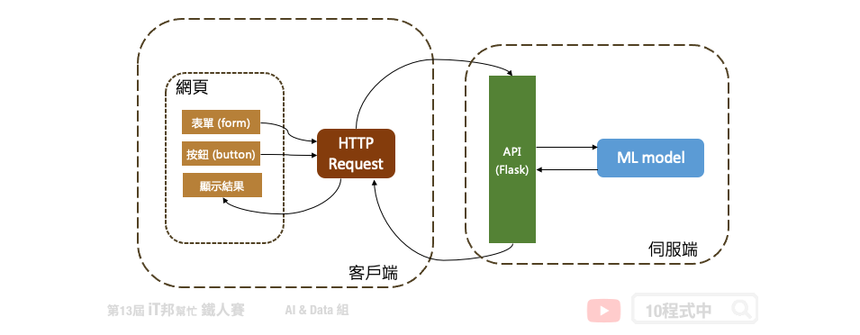

# 使用 Python Flask 架設 API 吧!

## 今日學習目標
- API 觀念講解
    - 什麼是 API？
    - RESTful API
    - HTTP Request 方法
- 手把手實作一個花朵分類器 API 
    - 透過 Python Flask 建置一個後端預測模型 API

## 前言
當模型訓練完以後下一個步驟就是應用與落地。我們可以設計一個嵌入式系統與使用者互動，例如樹莓派、Jetson Nano、NeuroPilot...等硬體來協助 AI 模型的邊緣運算。或是設計一個手機 APP 以及網頁應用。很多人可能會有疑問模型訓練好然後下一個步驟該怎做？最常見的做法就是將訓練好的模型儲存起來並建立一個 API 部署在後端伺服器中，接著任何的終端設備都可以透過這一個 API 進行資料的存取與模型預測。下圖是一個簡單的模型落地的應用情境，我們可以在後端伺服器部署模型並建立一個 API 的接口與前端使用者互動。前端網頁的使用者透過 HTTP 的協定與後端伺服器進行通訊與資料交換，最終模型的預測結果會回傳到前端使用者並將結果選染在網頁上。我們延續昨天的內容 [[Day 28] 儲存訓練好的模型](https://ithelp.ithome.com.tw/articles/10280076)，目前已經成功的輸出模型。今天就來教各位如何透過 Python Flask 架設一個鳶尾花朵分類器的 API 吧！

## 什麼是 API？
所謂的 API 中文全名為應用程式介面 (Application Programming Interface) 是屬於客戶端與伺服端的溝通橋樑，它提供一個端口能夠進行資料交換。簡單來說是一個前端與後端的一個溝通介面。

另外各位可能也有聽過一個名詞叫做 RESTful API。這邊就不細講了，有興趣的朋友可以參考我在2018 iT 邦幫忙鐵人賽的`從無到有，打造一個漂亮乾淨俐落的 RESTful API` 的系列文章 [[Day-7] RESTful API與MVC名詞介紹](https://ithelp.ithome.com.tw/articles/10191925) 同時那個系列是用 `Node.js` 建置一個後端 API 教學。

透過網路協定 HTTP Request 不同的方法，可以實現不同的資料交換請求方式。

## Python Flask API

## 測試API的好工具Postman
當你寫好一支 API 時要馬上測試看看你寫的程式邏輯是否正確，就可以使用 Postman 這個軟體來做 API 測試。詳細內容可以參考之前的鐵人賽文章[[Day-20] 測試API的好工具](https://ithelp.ithome.com.tw/articles/10194897)。

> 本系列教學內容及範例程式都可以從我的 [GitHub](https://github.com/andy6804tw/2021-13th-ironman) 取得！