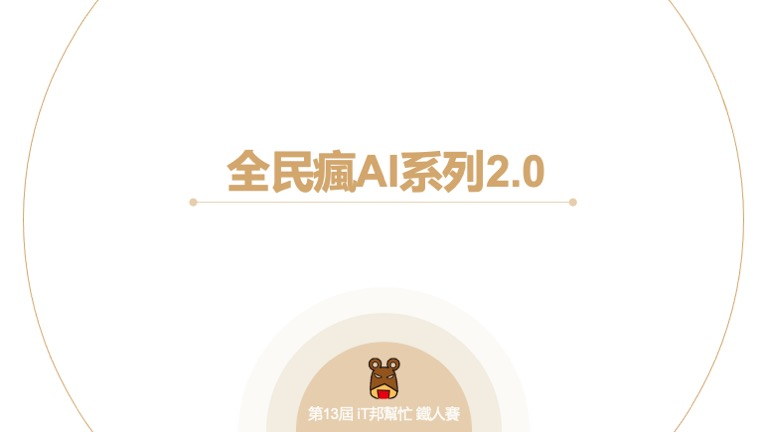

# 全民瘋AI系列2.0完賽總結
不知不覺就參加了三屆iT邦鐵人賽，很高興能夠藉由此活動分享經驗與知識。雖然這三十天過程很辛苦，但也透過這種方式督促我整理這些內容。在撰寫文章的過程中不僅能幫自己再次的複習，同時也能幫助到正在學習道路上的你們。在這裡再幫各位回顧一下這三十天的內容，首先讓大家初探了解何謂人工智慧以及目前的領域中有哪些是用到 AI 的技術。接著第三天從資料面開始探討，如何進行資料視覺化以及前處理。從第五天開始說明了機器學習種類以及機器如何學習，以及常規的機器學習專案必走的八個流程。接下來兩天首先進到非監督學習領域，探討如何透過降維的方式進行特徵篩選與集群演算法來對沒有標籤的資料進行聚類分析。接下來中間有十一天的時間講解目前主流的監督式學習的演算法，從最基本的線性模型到核模型以及決策樹系列演算法。甚至還提到了近幾年來在 Kaggle 熱門的機器學習模型與資料處理方法，還有自動化機器學習來幫助我們找到一個好的模型與超參數。另外最後幾篇講解了大家對於機器學習的迷思，透過實際案例來講解大家無形中常犯的錯誤。最後幾天以AI整合落地的主題手把手教大家如何將訓練好的模型儲存與建立一個機器學習 API 提供軟硬體整合。

#### 鐵人賽列表
| 文章 | 程式 |
| ------------- | ------------- |
| [[Day 1] 全民瘋AI系列2.0-機器學習實戰手冊](https://ithelp.ithome.com.tw/articles/10263409) | -  |
| [[Day 2] 快來探索AI的世界](https://ithelp.ithome.com.tw/articles/10263822) | -  |
| [[Day 3] 你真了解資料嗎？試試看視覺化分析吧！](https://ithelp.ithome.com.tw/articles/10264416) | [Code](https://colab.research.google.com/github/andy6804tw/2021-13th-ironman/blob/main/3.你真了解資料嗎？試試看視覺化分析吧！/3.你真了解資料嗎？試試看視覺化分析吧！.ipynb)  |
| [[Day 4] 咱們一起做資料清理和前處理](https://ithelp.ithome.com.tw/articles/10265253) | [Code](https://colab.research.google.com/github/andy6804tw/2021-13th-ironman/blob/main/4.咱們一起做資料清理和前處理/4.咱們一起做資料清理和前處理.ipynb)  |
| [[Day 5] 機器學習大補帖](https://ithelp.ithome.com.tw/articles/10265942) | - |
| [[Day 6] 非監督式學習 K-means 分群](https://ithelp.ithome.com.tw/articles/10266672) | [Code](https://colab.research.google.com/github/andy6804tw/2021-13th-ironman/blob/main/6.非監督式學習k-means分群/6.非監督式學習k-means分群.ipynb) |
| [[Day 7] 非監督式學習-降維](https://ithelp.ithome.com.tw/articles/10267685) | [Code](https://colab.research.google.com/github/andy6804tw/2021-13th-ironman/blob/main/7.非監督式學習-降維/7.非監督式學習-降維.ipynb) |
| [[Day 8] 線性迴歸 (Linear Regression)](https://ithelp.ithome.com.tw/articles/10268453) | [Code](https://colab.research.google.com/github/andy6804tw/2021-13th-ironman/blob/main/8.線性迴歸/8.線性迴歸.ipynb) |
| [[Day 9] 邏輯迴歸 (Logistic Regression)](https://ithelp.ithome.com.tw/articles/10269006) | [Code](https://colab.research.google.com/github/andy6804tw/2021-13th-ironman/blob/main/9.邏輯迴歸/9.邏輯迴歸.ipynb) |
| [[Day 10] 近朱者赤，近墨者黑 - KNN](https://ithelp.ithome.com.tw/articles/10269826) | [Code 1](https://colab.research.google.com/github/andy6804tw/2021-13th-ironman/blob/main/10.KNN/10.1.KNN(Classification-iris).ipynb)、[Code 2](https://colab.research.google.com/github/andy6804tw/2021-13th-ironman/blob/main/10.KNN/10.2.KNN(Regression).ipynb) |
| [[Day 11] 核模型 - 支持向量機 (SVM)](https://ithelp.ithome.com.tw/articles/10270447) | [Code 1](https://colab.research.google.com/github/andy6804tw/2021-13th-ironman/blob/main/11.SVM/11.1.SVM(Classification-iris).ipynb)、[Code 2](https://colab.research.google.com/github/andy6804tw/2021-13th-ironman/blob/main/11.SVM/11.2.SVR(Regression).ipynb) |
| [[Day 12] 決策樹 (Decision tree)](https://ithelp.ithome.com.tw/articles/10271143) | [Code 1](https://colab.research.google.com/github/andy6804tw/2021-13th-ironman/blob/main/12.決策樹/12.1.決策樹(Classification-iris).ipynb)、[Code 2](https://colab.research.google.com/github/andy6804tw/2021-13th-ironman/blob/main/12.決策樹/12.2.決策樹(Regression).ipynb) |
| [[Day 13] 整體學習 (Ensemble Learning)](https://ithelp.ithome.com.tw/articles/10271882) | - |
| [[Day 14] 多棵決策樹更厲害：隨機森林 (Random forest)](https://ithelp.ithome.com.tw/articles/10272586) | [Code 1](https://colab.research.google.com/github/andy6804tw/2021-13th-ironman/blob/main/14.隨機森林/14.1.隨機森林(Classification-iris).ipynb)、[Code 2](https://colab.research.google.com/github/andy6804tw/2021-13th-ironman/blob/main/14.隨機森林/14.2.隨機森林(Regression).ipynb) |
| [[Day 15] 機器學習常勝軍 - XGBoost](https://ithelp.ithome.com.tw/articles/10273094) | [Code 1](https://colab.research.google.com/github/andy6804tw/2021-13th-ironman/blob/main/15.XGBoost/15.1.XGBoost(Classification-iris).ipynb)、[Code 2](https://colab.research.google.com/github/andy6804tw/2021-13th-ironman/blob/main/15.XGBoost/15.2.XGBoost(Regression).ipynb) |
| [[Day 16] 每個模型我全都要 - 堆疊法 (Stacking)](https://ithelp.ithome.com.tw/articles/10274009) | [Code](https://colab.research.google.com/github/andy6804tw/2021-13th-ironman/blob/main/16.Stacking/16.house-price-prediction-stacking.ipynb) |
| [[Day 17] 輕量化的梯度提升機 - LightGBM](https://ithelp.ithome.com.tw/articles/10274577) | [Code](https://colab.research.google.com/github/andy6804tw/2021-13th-ironman/blob/main/17.LightGBM/17.creditcard-fraud-detection-lightgbm.ipynb) |
| [[Day 18] 機器學習 boosting 神器 - CatBoost](https://ithelp.ithome.com.tw/articles/10275263) | [Code](https://colab.research.google.com/github/andy6804tw/2021-13th-ironman/blob/main/18.CatBoost/18.CatBoost(house_prices).ipynb) |
| [[Day 19] 自動化機器學習 - AutoML](https://ithelp.ithome.com.tw/articles/10275842) | - |
| [[Day 20] 機器學習金手指 - Auto-sklearn](https://ithelp.ithome.com.tw/articles/10276333) | [Code](https://colab.research.google.com/github/andy6804tw/2021-13th-ironman/blob/main/20.Auto-Sklearn/20.Auto-sklearn(iris-classification).ipynb) |
| [[Day 21] 調整模型超參數利器 - Optuna](https://ithelp.ithome.com.tw/articles/10276835) | [Code](https://colab.research.google.com/github/andy6804tw/2021-13th-ironman/blob/main/21.Optuna/21.optuna-tutorial.ipynb) |
| [[Day 22] Python 視覺化解釋數據 - Plotly Express](https://ithelp.ithome.com.tw/articles/10277258) | [Code](https://colab.research.google.com/github/andy6804tw/2021-13th-ironman/blob/main/22.Plotly-Express/22.Plotly-Express.ipynb) |
| [[Day 23] 資料分布與離群值處理](https://ithelp.ithome.com.tw/articles/10278000) | [Code](https://colab.research.google.com/github/andy6804tw/2021-13th-ironman/blob/main/23.資料分布與離群值處理/23.資料分布與離群值處理.ipynb) |
| [[Day 24] 機器學習 - 不能忽視的過擬合與欠擬合](https://ithelp.ithome.com.tw/articles/10278254) | - |
| [[Day 25] 交叉驗證 Cross-Validation 簡介](https://ithelp.ithome.com.tw/articles/10278851) | - |
| [[Day 26] 交叉驗證 K-Fold Cross-Validation](https://ithelp.ithome.com.tw/articles/10279240) | - |
| [[Day 27] 機器學習常犯錯的十件事](https://ithelp.ithome.com.tw/articles/10279778) | - |
| [[Day 28] 儲存訓練好的模型](https://ithelp.ithome.com.tw/articles/10280076) | [Code](https://colab.research.google.com/github/andy6804tw/2021-13th-ironman/blob/main/28.儲存訓練好的模型/28.XGBoost(Classification-iris).ipynb) |
| [[Day 29] 使用 Python Flask 架設 API 吧！](https://ithelp.ithome.com.tw/articles/10280422) | [Code](https://github.com/andy6804tw/2021-13th-ironman/tree/main/29.使用Python-Flask架設API吧/Flask-API-example-with-ML-model) |
| [[Day 30] 使用 Heroku 部署機器學習 API](https://ithelp.ithome.com.tw/articles/10280857) | [Code](https://github.com/1010code/Flask-API-example-with-ML-model-heroku) |

希望未來還有機會再跟各位分享比較實作方面的主題。例如 TFLite 在手機上運行或是透過 TensorFlow.js 在網頁上的應用小專案。

> 本系列教學內容及範例程式都可以從我的 [GitHub](https://github.com/andy6804tw/2021-13th-ironman) 取得！