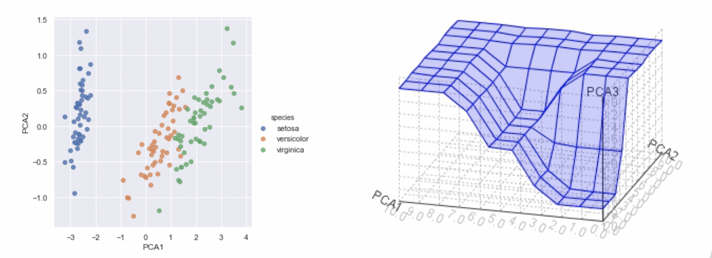
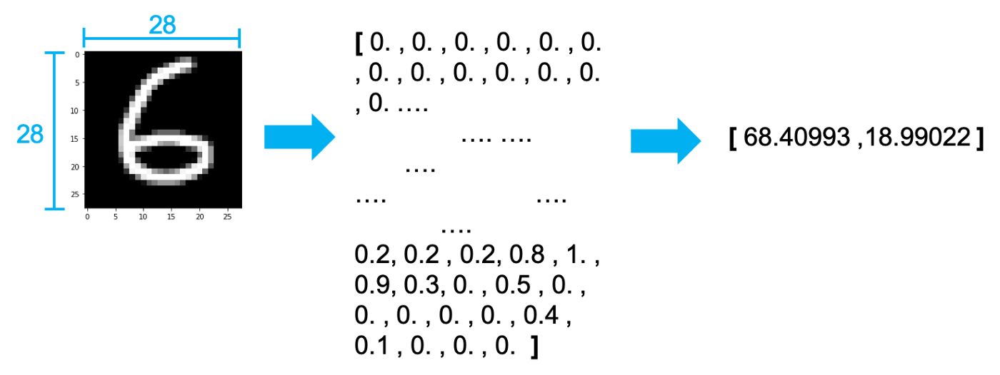
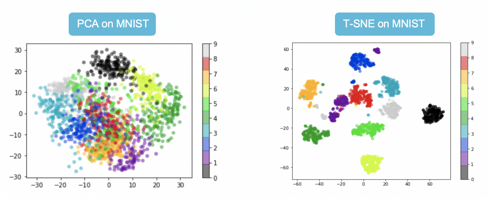

# 非監督式學習-降維

## 今日學習目標
- 降維觀念
    - 何謂降維? 降維有什麼優點?
- 常見兩種降維方法
    - PCA & t-SNE

## 降維 (Dimension Reduction)
一般資料常見的表示方法有一維(數線)、二維(XY平面)和三維(XYZ立體)。當大於三維的資料就難以視覺化呈現，那麼我們該如何表示高維度的資料同時又不能壓縮原本資料間彼此的關連性呢？這時降維就能幫助你了！降維顧名思義，就是原本的資料處於在一個比較高的維度作標上，我們希望找到一個低維度的作標來描述它，但又不能失去資料本身的特質。

## 為什麼要降維?
想想看如果我們能夠把一些資料做壓縮，同時又能夠保持資料原來的特性。因此我們可以用比較少的空間，或是計算時用比較少的資源就可以得到跟沒有做資料壓縮之前得到相似的結果。此外資料降維可以幫助我們進行資料視覺化，二維可以用平面圖表示、三維可以用立體圖作表示，而大於三維的空間難以視覺化做呈現。

## 降維演算法
常見的降維方法有兩種分別有線性方法的主成分分析(PCA)以及非線性的 t-隨機鄰近嵌入法(t-SNE)。下圖例子是將 28*28 大小的手寫數字照片，分別透過上述兩種降維方法將一張 784 個像素的影像降成 2 維並投射在平面座標上。我們可以發現 PCA 降為後可以大致將 0~9 的手寫數字照片在平面上分成十群，不過彼此間的界線還是很模糊。而我們透過 t-SNE 方法降為後可以看到平面上很清楚的將這十個數字分成十群。因此我們可以得知手寫數字的影像在非線性的降維轉換效果是比較好的。

- Principal component analysis (PCA)
- T-Distributed Stochastic Neighbor Embedding (t-SNE)

因為 t-SNE 允許非線性的轉換，此外 t-SNE 使用了更複雜的公式來表達高維與低維之間的關係。因此在這種 0~9 有十個分類的情況下可以確保彼此間的距離會被區隔該而不會重疊。

## Principal component analysis (PCA)
主成份分析(Principal component analysis, PCA)

## PCA & t-SNE 整理
PCA和t-SNE是兩個不同降維的方法，PCA的優點在於簡單若新的點要映射時直接代入公式即 可得出降維後的點。若t-SNE有新的點近來時我們沒有去計算新的點和舊的點之間的關係因此 我們無法將新的點投影下去。t-SNE的優點是可以保留原本高維距離較遠的點降維後依然保持 遠的距離，因此這些群降維後依然保持群的特性。

- PCA允許線性的轉換
- t-SNE允許非線性的轉換