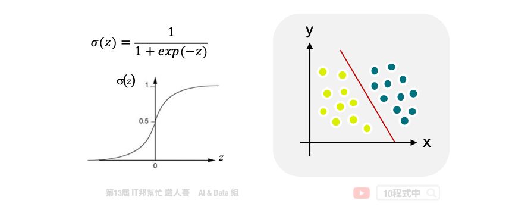
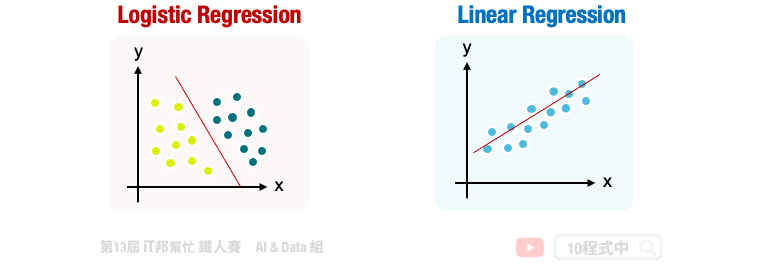
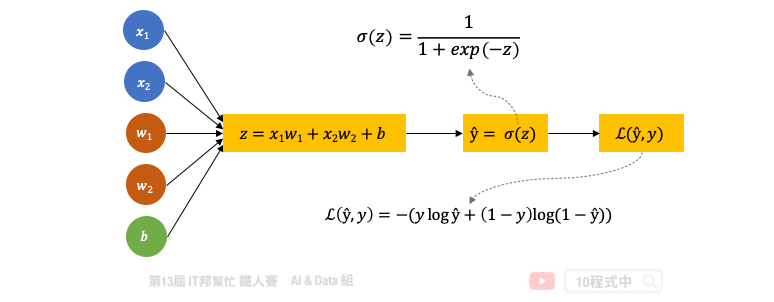
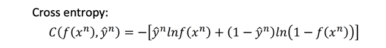

# 邏輯迴歸
## 今日學習目標
- 認識邏輯迴歸
    - 線性分類器
- 邏輯迴歸程式手把手
    - 使用邏輯迴歸建立鳶尾花朵分類器

## 邏輯迴歸 (Logistic regression)
邏輯迴歸 (Logistic regression) 是由線性迴歸變化而來的，它是一種分類的模型。其目標是要找出一條直線能夠將所有數據清楚地分開並做分類，我們又可以稱迴歸的線性分類器。邏輯迴歸其實是在說明一個機率的意義，透過一個 function 去訓練得到的一組參數，不同的 w,b 就會得到不同的 function。於是我們可以說 fw,b(x) 即為 posteriror probability。

## 線性回歸與邏輯迴歸
邏輯迴歸是用來處理分類問題，目標是找到一條直線可以將資料做分類。主要是利用 sigmoid function 將輸出轉換成 0~1 的值，表示可能為這個類別的機率值。而線性迴歸是用來預測一個連續的值，目標是想找一條直線可以逼近真實的資料。

## 邏輯迴歸學習機制
邏輯迴歸是一個最基本的二元線性分類器。我們要找一個機率 (posterior probability) 當機率 P(C1|x) 大於 0.5 時則輸出預測 Class 1，反之機率小於 0.5 則輸出 Class 2。如果我們假設資料是 Gaussian 機率分佈，我們可以說這個 posterior probability 就是 𝜎(𝑧)。其中 ` z=w*x+b`，x 為輸入特徵，而 w 與 b 分別為權重(weight)與偏權值(bias) 他們是透過訓練得到的一組參數。

以下就是一個 Logistic Regression 的運作機制，如果以圖像化表示會長這樣。我們的 function 會有兩組參數，一組是 w 我們稱為 weight，另一個常數 b 稱為 bias。假設我們有兩個輸入特徵，並將這兩個輸入分別乘上 w 再加上 b 就可以得到 z，然後通過一個 sigmoid function 得到的輸出就是 posterior probability。

在 Logistic Regression 中我們定義的損失函數是要去最小化的對象是所有訓練資料 cross entropy 的總和。我們希望模型的輸出要跟目標答案要越接近越好。因此我們可以將最小化的目標寫成一個函數：

最後是尋找一組最好的參數，使得 loss 能夠最低。因此這裡採用梯度下降 (Gradient Descent) 來最小化交叉熵 (Cross Entropy)。我們將損失函數對權重求偏導後，可以得到下面的權重更新的式子：

