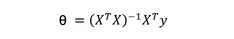
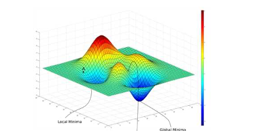
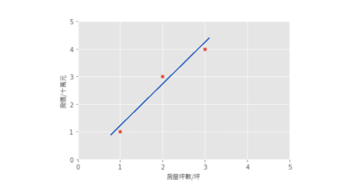
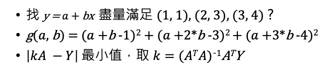
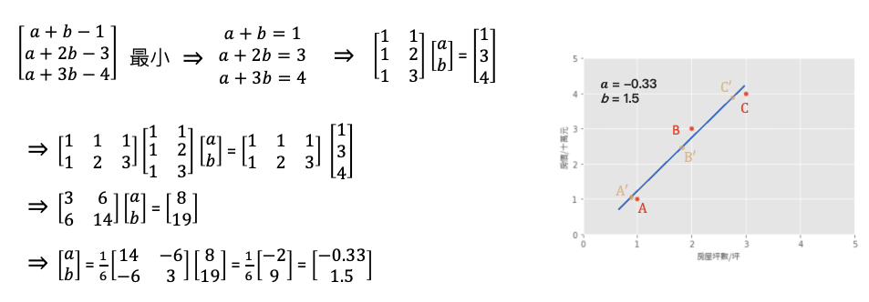
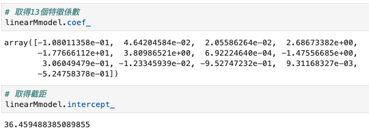
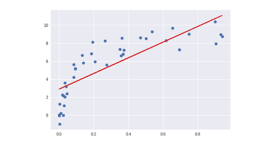
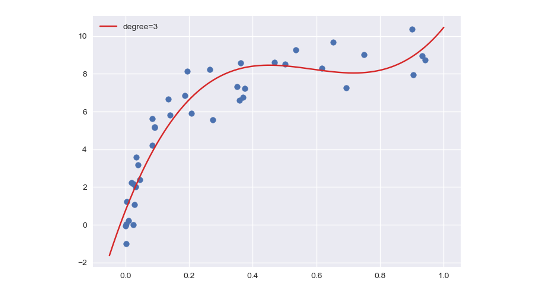

 
 # 線性迴歸(Linear Regression)
線性迴歸是統計上在找多個自變數和依變數之間的關係所建出來的模型。只有一個自變數(x)和一個依變數(y)的情形稱為簡單線性迴歸大於一個自變數(x1,x2,...)的情形稱為多元迴歸。

一個簡單線性回歸: y=ax+b，其中 b：截距(Intercept)，a：斜率(Slope) 為 x 變動一個單位 y 變動的量，如下圖:


回歸分析的目標函數或稱損失函數(loss function)就是希望找到的模型最終的殘差越小越好，來找參數 a 和 b。

## 兩種求解方法
線性模型最常見的解法有兩種，分別為 Closed-form (閉式解) 與梯度下降 (Gradient descent)。當特徵少時使用 Closed-form 較為適合，使用下面公式來求出 θ 值。我們又可以說線性模型的最小平方法的解即為 Closed-form。若當是複雜的問題時 Gradient descen 較能解決，其原因是大部分的問題其實是沒有公式解的。我們只能求出一個函數 f(x) 使其誤差最小越好。

- Closed-form

 

- Gradient descent

 


 ## Least Square Method (最小平方法)
 假設一個地區的房價與坪數是呈線性關係，並以下圖中的三個點表示。如果我們想透過房子的坪數來預測房價，那麼我們的目標就是找到一條直線，並與座標平面上這三個點的差距越小越好。那這條直線該怎麼找呢？首先我們隨機找一條直線，並計算這三點的 loss。損失函數可以自己定義，假設我們使用 MSE 均方誤差來計算。透過一系列計算我們得到一個 loss 即為 MSE 值。接著我們將這個直線稍稍的轉一個角度後又可以計算一個新的 MSE，此刻我們可以發現 MSE 值又比剛剛更小了。也就是說這一條新的直線能夠更法應出訓練集中 A、B、C 的數據點所反映的房屋坪數與房價之間的線性關係。
 
 
 
 簡單來說我們在一個二維空間中，我們可以找到無數條直線。現在我們能做的事情就是從這無數條直線中選出一條最佳的當作我們的預測模型，同時它面對這三點的誤差是要最小的。因此我們的目標就是要最小化 MSE 也就是所謂的損失函數 (loss function)。所以整個線性回歸的目標就是最小化我們的損失函數，其中一個解法就是最小平方法。因為 MSE 等於 1/n 倍的残差平方和 (RSS)，其中分母 n 為常數，不影響極小化故拿掉。因此最終的求解是滿足最小化平方和，使其最小化。經過數學推導後，簡化的公式如下：

 

### 小試身手
基於上面的公式我們想找出一組參數權重 θ。也就是下圖問題中的 a (θ<sub>0</sub>)、b (θ<sub>1</sub>) 兩參數，使得平面上這三點平方和有極小值。這個函式對 θ<sub>0</sub>, θ<sub>1</sub> 偏做微分設他們為0，接著我們對方程式求解。 此函式只有極小值，因此我們得到的 θ<sub>0</sub>, θ<sub>1</sub> 最小極值的解。





## 範例程式 (房價預測)
### 手刻線性回歸
我們透過 Sklearn 所提供的房價預測資料集進行線性回歸模型建模，並採用最小平法。首先為了要驗證我們上面的公式，因此我們先利用 Numpy 套件自己手刻做一系列的矩陣運算求出每一項的係數與截距。

```py
import numpy as np
import pandas as pd
from sklearn.metrics import mean_squared_error
from sklearn.datasets import load_boston

# 載入 Sklearn 房價預測資料集 13個輸入特徵 1個輸出特徵
boston_dataset = load_boston()
# 輸入特徵共13個
X = boston_dataset.data
# 設定截距項 b 權重值為 1 
b=np.ones((X.shape[0], 1))
# 添加常數項特徵，最終有 13+1 個輸入特徵
X=np.hstack((X, b))
# 輸出(房價)
y = boston_dataset.target

# 計算 Beta (@ 為 numpy 中 2-D arrays 的矩陣乘法)
Beta = np.linalg.inv(X.T @ X) @ X.T @ y
y_pred = X @ Beta

# MSE: 21.8948311817292
print('MSE:', mean_squared_error(y_pred, y))
```

計算出來 Beta 後我們再把所有的 X 帶入並做計算，算出來的結果 MSE 為 21.89。最後我們可以試著把 Beta 變數列印出來。總共會有 14 個參數，由 13 個輸入特徵係數與最後一項截距所組成的 θ。

輸出結果：
```
array([-1.08011358e-01,  4.64204584e-02,  2.05586264e-02,  2.68673382e+00,
       -1.77666112e+01,  3.80986521e+00,  6.92224640e-04, -1.47556685e+00,
        3.06049479e-01, -1.23345939e-02, -9.52747232e-01,  9.31168327e-03,
       -5.24758378e-01,  3.64594884e+01])
```

## 使用 Sklearn LinearRegression
線性回歸簡單來說，就是將複雜的資料數據，擬和至一條直線上，就能方便預測未來的資料。接下來我們一樣使用房價預測資料集，並使用 Sklearn 提供的 LinearRegression 來求解。

Parameters:
- fit_intercept: 是否有截距，如果沒有則直線過原點。

Attributes:
- coef_: 取得係數。
- intercept_: 取得截距。

Methods:
- fit: 放入X、y進行模型擬合。
- predict: 預測並回傳預測類別。
- score: R2 score 模型評估。

```py
import numpy as np
import pandas as pd
from sklearn.linear_model import LinearRegression
from sklearn.metrics import mean_squared_error
from sklearn.datasets import load_boston

# 載入 Sklearn 房價預測資料集 13個輸入特徵 1個輸出特徵
boston_dataset = load_boston()
# 輸入特徵共13個
X = boston_dataset.data
# 輸出(房價)
y = boston_dataset.target

# 訓練模型
linearMmodel = LinearRegression()
linearMmodel.fit(X, y)

y_pred = linearMmodel.predict(X)
# 21.894831181729202
print('MSE:', mean_squared_error(y_pred, y))
```

Sklearn 的 LinearRegression 模型也是採用小平方法求解。我們可以發現其 MSE 與稍早手刻的方法相當很接近。另外 Sklearn 模型同時也提供了 `coef_` 和 `intercept_` 兩個屬性可以取得模型的特徵係數與截距。



## 多項式的回歸模型 (PolynomialFeatures)
對於線性回歸來說，資料都是很均勻地分布在一條直線上，但現實的資料往往是非線性的分佈。如果我們一樣使用上述方法取得線性模型，在實際場域上預測效果可能並不大。



多項式回歸中，數據不太具有線性關係，因此應尋找一些非線性曲線去擬合。如下圖，用一條三次曲線去擬合數據，效果更好。

