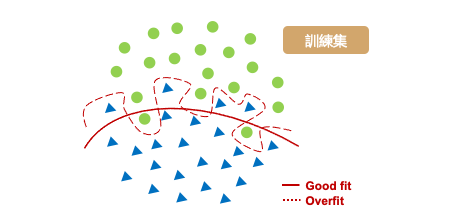
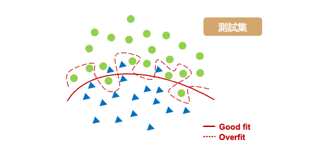
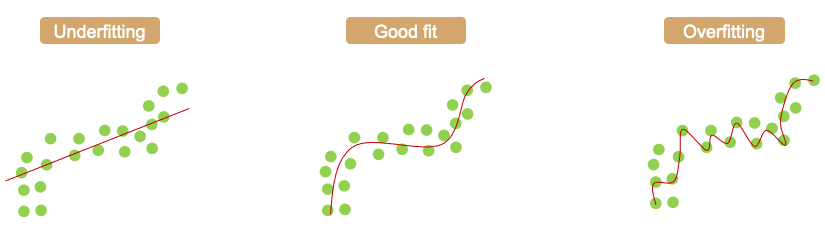

# Overfitting in Machine Learning: What It Is and How to Prevent It
在機器學習中大家可能最常見的問題是，當訓練好了模型並在測試資料也獲得不錯的成績。於是很開心的落地並部署到真實場域中，殊不知預測出來的結果遠遠不如預期。我想這個痛點大家應該都經歷過，尤其是機器學習的新手。這種情況就是所謂的過度擬合，它是一個在機器學習領域中非常棘手的的問題。當你的模型過度的擬合訓練集，這意味著你的模型過於複雜的去記住所有現有的數據點，進而導致模型的泛化能力不佳，這不是我們期望的。所謂的模型泛化能力是指，當我利用訓練集訓練一個模型後再拿另一組模型沒看過的資料進行預測，最終的預測結果如果在沒看過的資料中依然保持不錯的表現我們就可以說此模型泛化能力強。今天我們將來詳細探討何謂過度擬合，以及該如何去解決它使得模型處於一個適當的狀態。

## 如何選擇最佳的模型？
通常我們希望預測出來的結果要與實際的數值越接近越好，也就是在模型訓練的過程中我們要想辦法最小化誤差使得模型的誤差越小越好。那麼我們該如何評估訓練出來的模型好壞呢？以下圖為例，假設我們要訓練一個二元分類器。最簡單的方法是找出一條線夠將這兩個類別完整地分開，然而這一條切割的線要長得怎樣才是好的模型呢？從下圖我們可以發現紅色虛線的模型完整的擬合於訓練資料，而紅色實線的模型相對的比較沒有那麼嚴厲，在兩個類別間適當的找出一條平滑的曲線來區隔兩類的資料。

接著我們拿測試資料進行模型預測，可以發現由於紅色虛線的模型已經完整記住了訓練集的趨勢，因此在新的沒看過的資料表現就沒有那麼好了。尤其是在兩類別分隔線附近的資料最能看出端倪。於是我們可以很確定紅色虛線的模型已經過度擬合訓練資料了。另外紅色實現的模型雖然在訓練集中有幾筆會預測錯誤，但是它再測試集資料中一樣保持穩定的預測能力。

從上述的例子我們可以得知，在訓練模型時並非訓練集的誤差越小越好。我們必須同時拿測試集驗證模型的預測能力，目標是訓練集與測試集的平均誤差要越近越好。

## Overfitting vs. Underfitting
過度擬合的相反意思就是欠擬合，從字面上可以猜到模型預測能力是不好的。當模型太簡單時會發生欠擬合，或是加入太多的 L1/L2 正則化使模型在從數據集中學習時變得不靈活。一個過於簡單的模型在預測中往往具有較小的方差(variance)而導致偏差(bias)就會變大。相反的過於複雜的模型會有較的變異進而導致方差大，同時偏差會變小。偏差和方差都是機器學習中的預測誤差的方式。在一般情況下我們可以減少偏差所引起的誤差，但可能會導致增加方差引起的誤差，反之亦然。

## Bias-Variance Tradeoff
我們希望透過權衡 Bias Error 跟 Variance Error 來使得總誤差達到最小。

## Reference
- [Overfitting in Machine Learning: What It Is and How to Prevent It](https://elitedatascience.com/overfitting-in-machine-learning)
- [WTF is the Bias-Variance Tradeoff? (Infographic)](https://elitedatascience.com/bias-variance-tradeoff)
